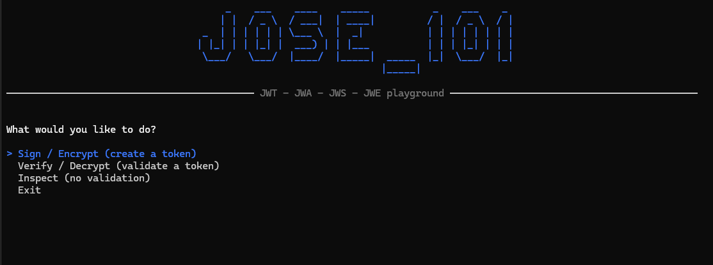
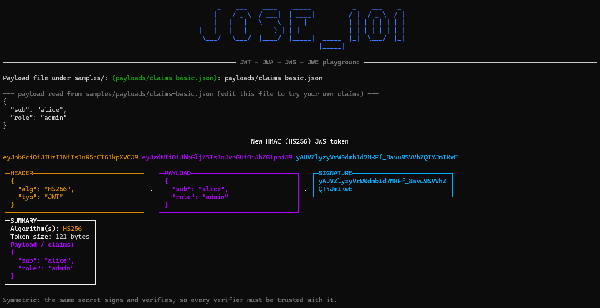
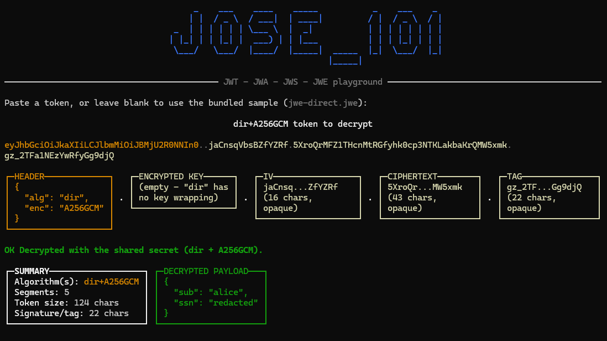

# JOSE_101

A .NET 10 console app showcasing **JWT, JWA, JWS, and JWE**, built on [`spectre.console`](https://github.com/spectreconsole/spectre.console) and [`jose-jwt`](https://github.com/dvsekhvalnov/jose-jwt).

- **JWT** (JSON Web Token) — the overall envelope/claims-set format.
- **JWA** (JSON Web Algorithms) — the registry of `alg`/`enc` values (HS256, RS256, ES256, A256GCM, ...) used below.
- **JWS** (JSON Web Signature) — a signed JWT: readable payload, tamper-evident.
- **JWE** (JSON Web Encryption) — an encrypted JWT: payload is opaque ciphertext.

## Structure

```
src/JOSE_101.Core         pure signing/encryption helpers (no I/O)
src/JOSE_101.ConsoleApp   interactive menu that calls into Core and renders the token breakdown
tests/JOSE_101.Core.Tests xUnit round-trip tests for every Core factory
keys/                     demo RSA, EC and HMAC keys — NOT for production, see keys/README.md
samples/                  pre-generated tokens, plus editable input payloads under samples/payloads
```

## Run it

```bash
dotnet run --project src/JOSE_101.ConsoleApp
```

You get an arrow-key menu:



Pick an action, then an algorithm. Before every sign/encrypt operation the app prints the exact payload it read from `samples/payloads/*.json` — edit those files to try your own claims, no rebuild needed.
Before every verify/decrypt/inspect operation you can paste a token or just press Enter to use a bundled sample from `/samples`.

## What you see on screen

Every token is rendered segment-by-segment so the `header.payload.signature` (or 5-part JWE) composition is visible at a glance:

- A single colored line with the raw token, each segment tinted to match its panel below.
- One panel per segment — **HEADER**, **PAYLOAD** (JWS only — never encrypted), **SIGNATURE**, or for JWE: **ENCRYPTED KEY** / **IV** / **CIPHERTEXT** / **TAG**.
- On verify/decrypt: a **VERIFIED PAYLOAD** (JWS) or **DECRYPTED PAYLOAD** (JWE) panel, then a white **SUMMARY** panel (algorithm(s), token size, claims).
- On `Inspect`: a red **! UNVERIFIED !** banner — the header/payload are decoded but nothing is signature-checked or decrypted, exactly like pasting into `jwt.io`'s debugger. Never treat that output as trusted.
- Pasting a malformed or wrong-type token (e.g. a JWE into a JWS verify flow) shows a clear red **ERROR** panel instead of crashing.

**JWS HMAC (HS256)** — payload is readable (base64url, not encrypted), signature is opaque:



**JWE direct (dir+A256GCM)** — everything after the header is opaque ciphertext:



## Menu → JWA algorithms

| Concept | `alg` | `enc` |
|---|---|---|
| JWS HMAC (symmetric) | HS256 | — |
| JWS RSA (asymmetric) | RS256 | — |
| JWS ECDSA (asymmetric) | ES256 | — |
| JWE direct (symmetric) | dir | A256GCM |
| JWE RSA-OAEP (asymmetric, key-wrapped) | RSA-OAEP | A256GCM |
| Nested (sign then encrypt) | caller-chosen (see below) | A256GCM |

**Nested is parameterized**, not fixed to one algorithm pair — the menu asks you to pick both sides, one prompt for "Sign with" (`hmac` / `rsa` / `ecdsa`) and one for "Encrypt with" (`dir` / `rsa-oaep`).
Unwrapping requires entering the *same* choices used to create the token — on purpose, the app never trusts the token's own header to decide how to verify it (that trust decision is exactly the "alg confusion" class of JWT vulnerability).

## Usage flow for a first-time reader

1. **Create** — `Sign / Encrypt` → `JWS HMAC (HS256)`, accept the default payload file → get back a token, rendered segment-by-segment.
2. **Inspect** — `Inspect (no validation)`, paste that token → see the header (`alg`, `typ`) and, for JWS, the raw unverified payload — exactly what `jwt.io`'s debugger shows. No crypto happens here; never use this output for authorization.
3. **Verify / decrypt** — `Verify / Decrypt` → `JWS HMAC (HS256)`, paste the same token → the signature is actually checked and you get the trusted payload back.

Repeat the same flow for RSA, ECDSA, JWE direct, JWE RSA-OAEP, and Nested to see how each algorithm family differs.

The [`/samples`](samples/README.md) folder has one pre-generated token per type if you'd rather paste straight into `jwt.io` than run the app.

## Why these algorithms

- **HMAC vs RSA vs ECDSA (JWS):** 
HMAC is symmetric — one shared secret signs and verifies, fastest, but every verifier must be trusted with the secret. 
RSA and ECDSA are asymmetric — sign with a private key, verify with a public key, so tokens can be safely verified by parties that must never be able to forge one.
ECDSA gives the same asymmetric guarantee as RSA with much smaller keys/signatures.
- **dir vs RSA-OAEP (JWE):** 
`dir` uses one shared secret directly as the content-encryption key — simplest and fastest, but symmetric (same trust model as HMAC). 
RSA-OAEP wraps a random per-message key with an RSA public key, so anyone with the public key can encrypt a message that only the private-key holder can decrypt.
- **Nested (sign-then-encrypt):** combines both — a JWS proves authenticity, then wrapping it in a JWE adds confidentiality.


## Tests

```bash
dotnet test tests/JOSE_101.Core.Tests
```

Round-trip tests for every `JOSE_101.Core` factory ( sign→verify, encrypt→decrypt, nested sign-then-encrypt → decrypt-then-verify) plus a wrong-key-fails check for each. `JOSE_101.ConsoleApp` has no tests — it's a thin, purely interactive layer over `Core`.
