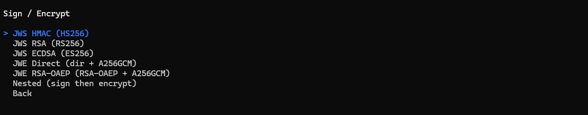
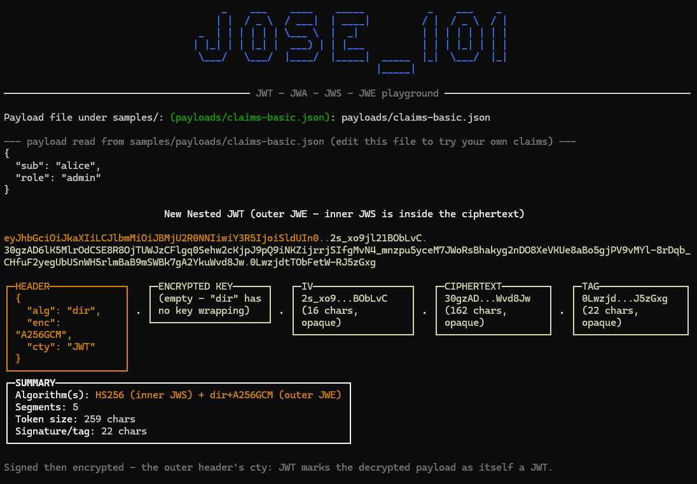

# JOSE_101

A .NET 10 console app for learning JWT, JWA, JWS, and JWE hands-on, built on [`spectre.console`](https://github.com/spectreconsole/spectre.console) and [`jose-jwt`](https://github.com/dvsekhvalnov/jose-jwt).

Check the <a href="https://falberthen.github.io/posts/jose101-pt1/" target="_blank">blog</a> for a detailed walkthrough.

<br/>

 [](https://opensource.org/licenses/MIT)

 


## Structure

```
src/JOSE_101.Core          pure signing/encryption helpers (no I/O).
src/JOSE_101.ConsoleApp    interactive menu that calls into Core and renders the token breakdown.
tests/JOSE_101.Core.Tests  xUnit round-trip tests for every Core factory.
keys/                      demo RSA, EC and HMAC keys — NOT for production, see keys/README.md.
samples/                   pre-generated tokens, plus editable input payloads under samples/payloads.
```


## Run it

```bash
dotnet run --project src/JOSE_101.ConsoleApp
```

You get an arrow-key menu
1. Pick an action:


2. Then pick an algorithm:



💡 Before every `sign/encrypt` operation, the app prints the exact payload it read from `samples/payloads/*.json`.
💡 Before every `verify/decrypt/inspect` operation you can paste a token or just press `Enter` to use a bundled sample from `/samples`.


## Samples

#### JWS 


#### JWE


#### Nested



**💡 Nested is parameterized**, not fixed to one algorithm pair.

- The menu asks you to pick both sides, one prompt for "Sign with" (`hmac` / `rsa` / `ecdsa`) and one for "Encrypt with" (`dir` / `rsa-oaep`).
- Unwrapping requires entering the *same* choices used to create the token.

The [`/samples`](samples/README.md) folder has one pre-generated token per type if you'd rather paste straight into `jwt.io` than run the app.


## Tests

```bash
dotnet test tests/JOSE_101.Core.Tests
```

<br/>

<p align="center">
  Made with ❤️ by <a href="https://github.com/falberthen">Felipe Henrique</a>